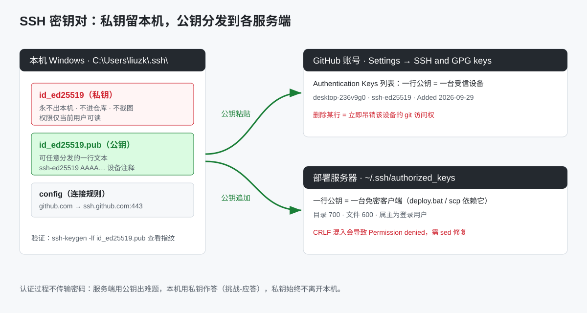
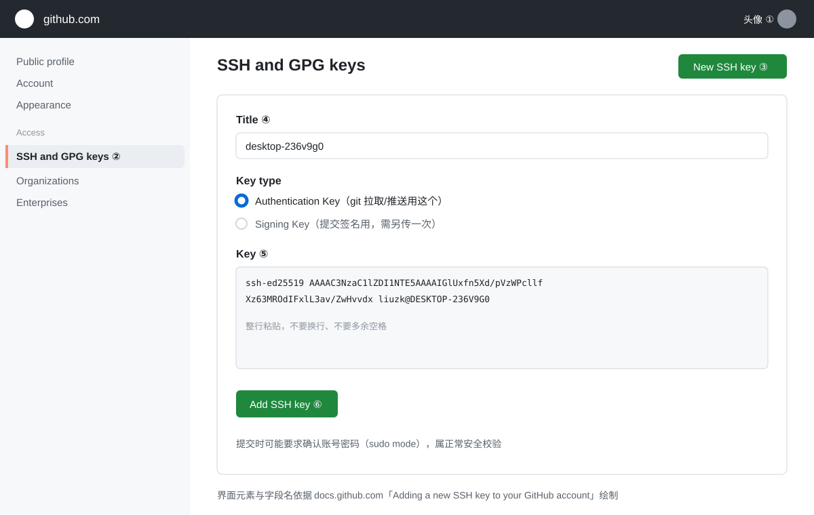
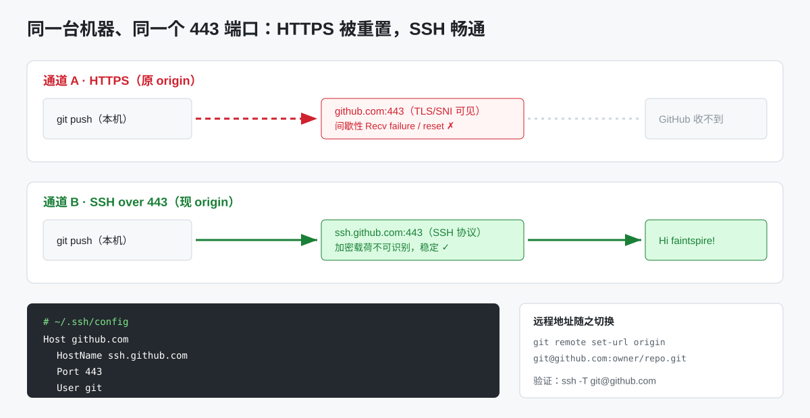

# SSH 密钥使用文档（GitHub 与部署服务器）

> 📍 **存放位置**：本文档属于个人公共知识库 `faintspire-kb`（Public）。文中引用的《部署配置文档》《一键部署改造说明》为公司内部文档，在公司私有仓库 `faintspire/sangerbox-server` 的 `doc/` 目录；本文仅收录通用 SSH 配置知识。

| 项目 | 内容 |
|---|---|
| 适用对象 | 本机（Windows）向 GitHub 推送代码、向部署服务器免密部署的全部场景 |
| 密钥位置 | `C:\Users\liuzk\.ssh\id_ed25519`（私钥） / `id_ed25519.pub`（公钥） |
| 关联文档 | 《GitHub操作文档》2.2 / 3.4 节、《部署配置文档》、《一键部署改造说明-20260922》 |
| 更新日 | 2026-09-29 |
| 配图约定 | 全部为**无水印 SVG 线框图**，界面字段依据 docs.github.com 真实页面与本机真实 `~/.ssh` 配置绘制；按团队规范不使用 mermaid / ASCII 图 |

---

## 1. SSH key 是什么、为什么用它

### 1.1 原理（一句话版）

SSH 密钥是一对数学关联的文件：**私钥**（`id_ed25519`）永远留在本机，**公钥**（`id_ed25519.pub`）是一行可公开文本，放到服务端白名单里。连接时服务端用公钥"出难题"，本机用私钥"作答"（挑战-应答），**全程不传输密码**，答对即放行。见图 1。



### 1.2 与 HTTPS + Token 的分工

| 场景 | 用什么 | 说明 |
|---|---|---|
| 命令行 `git push / pull / clone`（GitHub） | **SSH**（本文） | 免凭据弹窗、不怕 HTTPS 链路被 reset |
| IDEA 内置 GitHub 集成（克隆列表、PR 面板） | **Classic Token** | IDEA 按 token scopes 校验，见《GitHub操作文档》3.4 |
| `deploy.bat` / `scp` 上传 jar 到服务器 | **SSH** | Windows 的 scp 不支持命令行传密码，只能靠密钥 |
| 调用 GitHub REST API | Token | SSH 不走 HTTP API |

---

## 2. 本机密钥现状

| 文件 | 作用 | 纪律 |
|---|---|---|
| `~/.ssh/id_ed25519` | 私钥 | 永不出本机；不进仓库；不截图；不粘贴到聊天 |
| `~/.ssh/id_ed25519.pub` | 公钥 | 可分发；GitHub 与所有服务器共用这一份 |
| `~/.ssh/config` | 连接规则 | 2026-09-28 建立：`github.com → ssh.github.com:443` |
| `~/.ssh/known_hosts` | 服务端指纹存档 | 首次连接自动写入；服务端重装后会报 WARNING，核实后再删对应行 |

常用命令：

```powershell
ssh-keygen -lf $env:USERPROFILE\.ssh\id_ed25519.pub   # 查看指纹（SHA256:…），与服务端比对用
Get-Content $env:USERPROFILE\.ssh\id_ed25519.pub      # 输出公钥全文用于粘贴
```

---

## 3. 生成与更换密钥

**生成新密钥**（已有则跳过；注释写邮箱或设备名便于日后识别）：

```powershell
ssh-keygen -t ed25519 -C "liuzhenkun@sangerbox.com" -f $env:USERPROFILE\.ssh\id_ed25519
```

- 提示 passphrase 时：个人开发机可回车留空（配合私钥文件权限使用）；共享机器**必须**设置；
- PowerShell 传空字符串参数会被吞掉导致 keygen 失败，必要时用停止解析符：`ssh-keygen --% -t ed25519 -C "x" -N ""`；
- GitHub 自 2022-03-15 起**不再接受 DSA（ssh-dss）**，RSA 新键需 SHA-2 签名；**统一用 ed25519**。

**更换/轮换流程**（丢设备、离职、疑似泄露）：

1. 生成新密钥对；
2. 新公钥加到 GitHub 与每台服务器；
3. 验证新键可用后，**删除各端旧公钥行**（GitHub 列表 Delete；服务器 authorized_keys 删行）；
4. 本机销毁旧私钥文件。

---

## 4. 配置到 GitHub（网页操作）

界面与字段名见图 2（依据 docs.github.com「Adding a new SSH key to your GitHub account」）。



1. **复制公钥**（Windows 推荐，避免 PowerShell 的 `<` 解析报错）：
   ```powershell
   cat $env:USERPROFILE\.ssh\id_ed25519.pub | clip
   ```
   官方文档的 `clip < ~/.ssh/id_ed25519.pub` 在 PowerShell 下会报 *The '<' operator is reserved*，用上面的管道写法；
2. **①** 右上角头像 → **Settings**；
3. **②** 左侧 Access 分组 → **SSH and GPG keys**；
4. **③** 绿色按钮 **New SSH key**；
5. **④** Title 填设备名（如 `desktop-236v9g0`）；Key type 选 **Authentication Key**（Signing Key 仅用于提交签名，需另传一次）；
6. **⑤** Key 框粘贴公钥**整行**（不换行、不多空格）；
7. **⑥** **Add SSH key**；可能触发 sudo mode 要求确认账号密码，属正常；
8. 验证：`ssh -T git@github.com`，出现 `Hi <用户名>! You've successfully authenticated...` 即成功（**该命令退出码为 1 是正常的**，因为它不给 shell）。

命令行替代（已装 GitHub CLI 时）：`gh ssh-key add $env:USERPROFILE\.ssh\id_ed25519.pub -t "desktop-236v9g0"`。

---

## 5. 配置到部署服务器

`deploy.bat` 与 `scp` 依赖服务器侧白名单 `~/.ssh/authorized_keys`（一行公钥 = 一台免密客户端）。

**追加公钥到服务器**（Windows 无 ssh-copy-id，二选一）：

```powershell
# 方式一：管道追加（注意 CRLF 风险，见下）
Get-Content $env:USERPROFILE\.ssh\id_ed25519.pub | ssh user@host "mkdir -p ~/.ssh && cat >> ~/.ssh/authorized_keys"
# 方式二：手动复制公钥文本，在服务器上 echo 追加（最稳）
```

**服务器侧权限与修复**：

```bash
chmod 700 ~/.ssh && chmod 600 ~/.ssh/authorized_keys
# Windows 管道/type 易带入 CRLF，导致公钥行失效报 Permission denied：
sed -i 's/\r$//' ~/.ssh/authorized_keys
```

**验证免密**：

```powershell
ssh -o BatchMode=yes user@host "echo OK"   # 输出 OK 且无密码提示即通过
```

历史教训（2026-09-22 部署改造）：公钥上传后仍 `Permission denied`，根因即 Windows `type` 管道带入 CRLF；执行上面 `sed` 后恢复。详见《一键部署改造说明-20260922》。

---

## 6. GitHub 改走 SSH over 443（2026-09-28 实战）

**背景**：HTTPS 推送多次出现 `Recv failure: Connection was reset` / `Could not connect to github.com port 443`（跨境链路对 443 TLS 的间歇性重置）。GitHub 提供 `ssh.github.com:443`，SSH 加密载荷不可被识别拦截，同端口不同协议，稳定可用。见图 3。



**本机已完成的配置**（新机器照抄）：

1. `~/.ssh/config` 内容：
   ```
   Host github.com
       HostName ssh.github.com
       Port 443
       User git
       IdentityFile ~/.ssh/id_ed25519
   ```
2. 远程地址切换：
   ```powershell
   git remote set-url origin git@github.com:faintspire/sangerbox-server.git
   ```
3. 验证与推送：`ssh -T git@github.com` → `git push -u origin --all`。

**回退方法**（若 SSH 通道异常）：`git remote set-url origin https://github.com/faintspire/sangerbox-server.git` 并删除 config 中该 Host 段即可，二者可随时互换，不影响仓库内容。

---

## 7. 一钥多用与吊销

| 服务端 | 公钥存放位置 | 吊销方式 |
|---|---|---|
| GitHub | 账号 Settings → SSH and GPG keys 列表 | 删除对应行，该设备 git 访问立即失效 |
| 部署服务器 | `~/.ssh/authorized_keys` | 删除对应行 |
| 其他内网机器 | 同上 | 同上 |

- 一把私钥可同时登记到任意多个服务端，**无需为每个服务端单独生成**；
- 设备丢失/重装：先在各服务端删旧公钥，再决定是否吊销私钥；
- 定期（建议每季度）审查 GitHub 的 key 列表与服务器 authorized_keys，清理不认识的设备行。

---

## 8. 安全规范

1. 私钥文件**不得**进入任何 Git 仓库、聊天、截图、云盘；仓库 `.gitignore` 建议追加 `id_*`、`*.pem` 兜底；
2. 公钥可公开，但**不要**把「公钥 + 服务器 IP + 用户名」三件套一起外发；
3. 共享机器上的私钥必须设 passphrase；
4. 服务端 `PermitRootLogin` 建议保持 `no` / `prohibit-password`，密钥登录只开普通用户；
5. 疑似泄露按第 3 节轮换流程执行，**先加新、后删旧**，避免把自己锁在外面；
6. Token 与 SSH key 是两套凭据：token 泄露去 Developer settings 撤销，key 泄露去 SSH keys 列表删除，互不替代。

---

## 9. 常见问题 FAQ

| # | 现象 | 原因与处理 |
|---|---|---|
| 1 | `Permission denied (publickey)` | 公钥未加到对应服务端 / 加错账号 / authorized_keys 含 CRLF（`sed -i 's/\r$//'`）/ 权限不是 600 |
| 2 | `ssh -T` 成功但退出码是 1 | 正常现象，GitHub 不提供 shell，看输出文字不看退出码 |
| 3 | `Host key verification failed` / WARNING: REMOTE HOST IDENTIFICATION CHANGED | 服务端重装或中间人；核实后 `ssh-keygen -R <host>` 再重连 |
| 4 | HTTPS 推送被 reset，SSH 却正常 | 链路对 TLS SNI 的间歇性重置；保持 SSH over 443 方案，见第 6 节 |
| 5 | IDEA 推送仍走 HTTPS 报错 | IDEA 用远程 URL 决定协议；origin 已改 SSH 后 IDEA 自动跟随；其 GitHub 面板仍用 token，互不影响 |
| 6 | 新机器克隆后 push 报权限错 | 新机器没有私钥：拷贝私钥（不推荐）或在新机器生成新键并登记到各服务端（推荐） |
| 7 | 公钥粘贴后 GitHub 报 "Key is already in use" | 同一公钥已登记在另一个账号/仓库 deploy key；换注释重生成或从旧账号删除 |
| 8 | 服务器免密时好时坏 | 多为 authorized_keys 被重复追加出坏行；清理重复行并检查 CRLF 与权限 |

---

## 10. 验证清单

- [ ] `ssh-keygen -lf` 能输出 ed25519 指纹；
- [ ] 公钥已登记 GitHub（Settings → SSH and GPG keys 可见设备名）；
- [ ] `ssh -T git@github.com` 输出 `Hi <用户名>!`；
- [ ] `git remote -v` 的 origin 为 `git@github.com:…`；
- [ ] 一次真实 `git push` 走 SSH 成功；
- [ ] 服务器 `ssh -o BatchMode=yes user@host "echo OK"` 无密码提示；
- [ ] `deploy.bat` 全流程免密跑通；
- [ ] 私钥未出现在任何仓库 / 聊天 / 截图中。

---

## 附：图索引与配图规范

| 图 | 文件 | 内容 |
|---|---|---|
| 图 1 | `images/ssh-1-keypair-placement.svg` | 私钥留本机、公钥分发 GitHub 与服务器 |
| 图 2 | `images/ssh-2-github-add-key-ui.svg` | GitHub 添加 SSH key 真实界面（字段名依据官方文档） |
| 图 3 | `images/ssh-3-ssh-over-443.svg` | HTTPS 被重置 vs SSH over 443 畅通 + config 片段 |

配图规范（2026-09-29 起执行）：

1. 文档配图**不得带任何 AI 生成水印**；历史 10 张 PNG 的角标已于 2026-09-29 用背景色覆盖清除；
2. 界面类示意图须**参照真实网站界面**（字段名、按钮文案、布局以官方页面为准）绘制为 SVG，不使用凭空想象的线框；
3. 按团队规范不使用 mermaid 与 ASCII 图，流程一律用编号步骤或表格表达。
