# GitHub 操作文档

> 📍 **存放位置**：本文档属于个人公共知识库 `faintspire-kb`（Public）。文中「公司仓库」指公司私有仓库 `faintspire/sangerbox-server`，其业务文档在该库 `doc/` 目录；本文仅收录通用 GitHub 操作知识。

> **文档定位**：团队 GitHub 使用统一手册。覆盖 **建库 / 拉取 / 推送 / 外观设置 / 文档在线化 / Pages 静态站 / 仓库删除与退出** 八大主题；后续任何 GitHub 功能的操作说明都**追加到本文档的新章节**，不再单独建新文档。
> **历史**：本文档前身为《GitHub 外观（Appearance）设置操作指南》，自 2026-09-28 起升级为通用操作文档（外观章节保留在第四章）。
> **配图约定**：配图为 `images/` 目录下的线框示意图（非真实截图），图中红色序号 ①②③… 与正文步骤一一对应。

## 目录

| 章节 | 内容 |
|---|---|
| [一、创建 GitHub 仓库（建库）](#一创建-github-仓库建库) | 网页建库、初始化选项、命令行建库 |
| [二、拉取代码（clone / pull）](#二拉取代码clone--pull) | 首次克隆、SSH 免密、关联远程库、日常更新 |
| [三、推送代码（add / commit / push）](#三推送代码add--commit--push) | 标准流程、推送被拒处理、凭证、体积限制、IDEA Token 绑定 |
| [四、外观（Appearance）设置](#四外观appearance设置) | 主题切换与系统联动 |
| [五、将 doc/ 迁移为独立 GitHub 文档库](#五将-doc-迁移为独立-github-文档库) | 建文档库、复制推送、日常同步、subtree 拆分 |
| [六、GitHub Pages 静态资源网站](#六github-pages-静态资源网站) | 参考站原理、搭建步骤、Docsify、私有库+链接指引页模式、常见坑 |
| [七、删除存储库](#七删除存储库) | Danger Zone 删除、删除前检查、Archive 替代方案 |
| [八、退出别人的项目存储库](#八退出别人的项目存储库) | 协作者 Leave、退出组织、删 fork、Unwatch |
| [九、常见问题 FAQ](#九常见问题-faq) | 推送被拒、Pages 404、误删恢复等 |
| [十、验证清单](#十验证清单) | 建库 / 迁移 / Pages / 删除退出 自检 |

---

## 一、创建 GitHub 仓库（建库）

### 1.0 前置：登录 GitHub

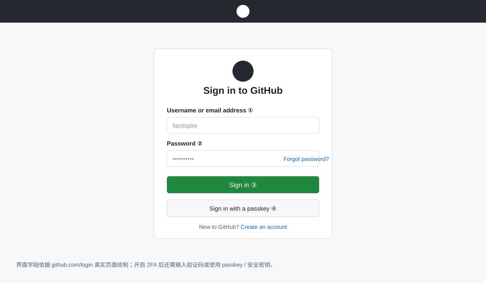

1. 打开 github.com，未登录会进入登录页：**①** 用户名/邮箱、**②** 密码 → **③** Sign in；或使用 **④** Sign in with a passkey；
2. 开启 2FA 的账号需再输入验证码或使用安全密钥；
3. 所有 Settings 类操作（建库、Pages、删除、Token）都要求登录态，匿名访问会被重定向到该页。

### 1.1 网页建库（推荐）

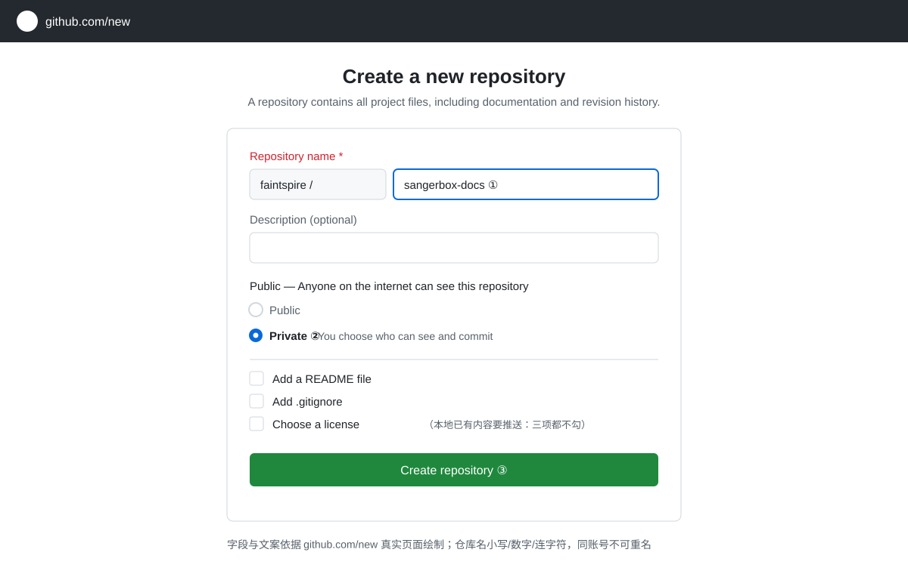

1. 登录 GitHub，点击**右上角 `+` 号 → New repository**（或直接访问 `https://github.com/new`）；
2. **①** 填写仓库名：建议**小写字母、数字、连字符**，如 `sangerbox-docs`；同一账号下不可重名；
3. **②** 选择可见性：
   - **Private**：仅自己/被邀请者可见 —— **公司内部文档、代码一律选这个**；
   - **Public**：全网可见 —— 仅用于开源项目；
4. **③** 点击绿色按钮 **Create repository** 完成创建。

### 1.2 初始化选项怎么选

建库页有三个可勾选项，**勾不勾直接影响你第一次 push 是否顺利**：

| 选项 | 作用 | 建议 |
|---|---|---|
| Add a README file | 生成含 README 的首次提交 | **本地已有内容要推送时：不勾**（空库 push 最顺）；纯网页管理可勾 |
| Add .gitignore | 生成忽略文件模板 | 代码库建议勾（选 Java/Node 等模板）；纯文档库可不勾 |
| Choose a license | 添加开源许可证 | 内部 Private 库不需要；开源项目按需选择 |

> ⚠️ 若勾了 README 而本地已有提交，首次 `git push` 会被拒绝（远程有你本地没有的提交），处理方式见 [3.1](#31-推送被拒non-fast-forward)。

### 1.3 命令行建库（可选，需 GitHub CLI）

```bash
gh auth login          # 首次使用先登录
gh repo create sangerbox-docs --private --clone
```

---

## 二、拉取代码（clone / pull）

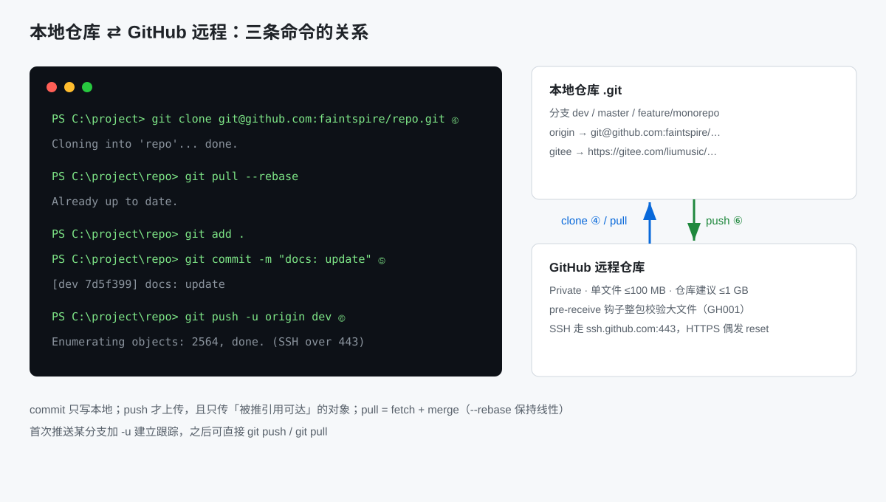

### 2.1 首次克隆（**④**）

```bash
git clone https://github.com/<用户名>/<仓库名>.git
cd <仓库名>
```

只拉指定分支：

```bash
git clone -b dev https://github.com/<用户名>/<仓库名>.git
```

### 2.2 SSH 方式（免每次输入账号密码，推荐长期使用）

```bash
ssh-keygen -t ed25519 -C "your@email.com"     # 一路回车即可
cat ~/.ssh/id_ed25519.pub                      # 复制输出内容
```

把公钥内容添加到：GitHub → 头像 → **Settings → SSH and GPG keys → New SSH key**，然后改用 SSH 地址克隆：

```bash
git clone git@github.com:<用户名>/<仓库名>.git
```

### 2.3 已有本地目录关联远程库

本地已有项目、远程刚建好空库时：

```bash
git init
git remote add origin https://github.com/<用户名>/<仓库名>.git
git add .
git commit -m "init: 初始化仓库"
git branch -M main
git push -u origin main
```

### 2.4 日常更新本地代码

```bash
git pull                 # 拉取并合并当前分支
git pull --rebase        # 推荐：保持线性历史，少产生 merge 提交
```

本地新建分支跟踪远程分支：

```bash
git switch -c dev origin/dev
```

---

## 三、推送代码（add / commit / push）

### 3.0 标准三步（**⑤⑥**）

```bash
git add .                          # 暂存全部改动（或 git add <文件> 精确添加）
git commit -m "docs: 更新 GitHub 操作文档"   # ⑤ 提交到本地
git push                           # ⑥ 推送到远程
```

首次推送某分支时加 `-u` 建立跟踪关系，之后可直接 `git push`：

```bash
git push -u origin main
```

提交信息建议带类型前缀：`docs:` 文档、`feat:` 新功能、`fix:` 修复、`chore:` 杂项。

### 3.1 推送被拒（non-fast-forward）

报错含 `rejected` / `non-fast-forward` / `fetch first` 时，说明远程有你本地没有的提交：

```bash
git pull --rebase        # 先把远程改动垫到本地提交之下
# 若有冲突：手动解决后 git add . && git rebase --continue
git push
```

### 3.2 凭证问题

- **HTTPS** 方式首次推送会弹出登录；Windows 下凭据由**凭据管理器**保存，换账号时在「控制面板 → 凭据管理器 → Windows 凭据」中删除 `git:https://github.com` 条目后重试；
- 频繁操作或 CI 场景建议改用 [2.2 的 SSH 方式](#22-ssh-方式免每次输入账号密码推荐长期使用)。

### 3.3 体积与忽略规则

- GitHub 单文件上限 **100 MB**，仓库建议控制在 1 GB 内；**图片入库前先压缩**；
- 代码库务必配置 `.gitignore`，避免把 `logs/`、`target/`、`.idea/` 等推上去；文档库无此问题；
- **教训案例（2026-09-28）**：`*/logs/*.log` 运行日志曾被误提交（单文件 233 MB），push 被 GitHub GH001 整包拒绝；`.gitignore` 必须从项目初始化就包含 `logs/` 与 `*.log`；已入库的历史大文件只能改写历史清除，见 FAQ 20。

### 3.4 IntelliJ IDEA 内置 GitHub 集成的 Token 配置

IDEA 的 **Settings → Version Control → GitHub → Add GitHub Account** 弹窗需要填入 Personal Access Token（PAT），并要求 scopes：`repo, gist, read:org, workflow, read:user, user:email`。

**最省事方式**：直接点弹窗里的 **Generate...** 按钮 —— IDEA 会打开浏览器并**预填好所需 scopes 与描述**的建 token 页面，生成后复制回填即可。

**手动方式**（图 10）：

1. **⑯** GitHub 头像 → Settings → 左侧最底部 **Developer settings**；
2. **Personal access tokens → Tokens (classic) → Generate new token (classic)**；
3. Note 填用途（如 `idea-sg-sangerbox`）；**⑰** Expiration 选 30/90 天（**不要选 No expiration**）；
4. **⑱** 勾选 scopes：`repo`、`gist`、`read:org`、`workflow`、`read:user`、`user:email`（勾 repo 会自动带上其子项）；
5. **⑲** 点绿色 **Generate token**；
6. **⑳** **立即复制** `ghp_` 开头的字符串 —— **只显示这一次**，关掉页面就再也看不到；
7. 粘贴进 IDEA 弹窗 Token 框 → **Add Account**；token 由 IDEA 存入系统凭据库，无需自己保存。

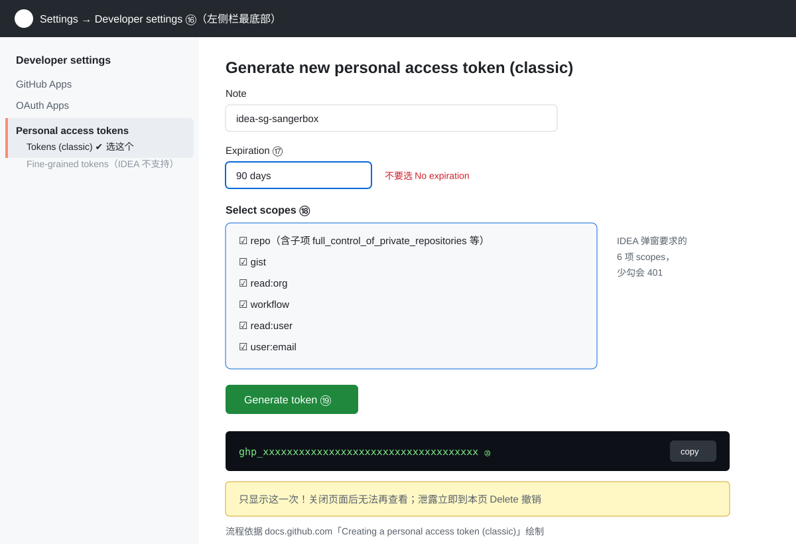

> ⚠️ 选 **Tokens (classic)** 而不是 Fine-grained：IDEA 该弹窗按 classic scopes 校验，fine-grained token 在 IDEA 集成中支持不完整（gist / workflow 等受限）。
> ⚠️ Token 等同密码：不要提交进仓库、不要贴聊天或截图；怀疑泄露立即到同一页面 **Delete** 撤销并重新生成。
> 验证绑定成功：IDEA 的 Git → Clone 窗口能列出你的 GitHub 仓库列表。

---

## 四、外观（Appearance）设置

| 项目 | 内容 |
|---|---|
| 适用页面 | https://github.com/settings/appearance |
| 生效范围 | 仅 github.com 网页端（Desktop 客户端与手机 App 有独立主题设置） |

GitHub 的 Appearance 设置用于切换网页端**配色主题**，共三个选项：

| 选项 | 效果 | 适用场景 |
|---|---|---|
| **Light** | 浅色主题，白底黑字 | 光线充足环境、投屏演示 |
| **Dark** | 深色主题，黑底浅字 | 夜间编码、降低眩光 |
| **Sync with system** | 跟随操作系统浅色/深色自动切换 | 系统已配置定时切换的用户 |

切换主题会同时影响代码块语法高亮、Markdown 预览、组织与企业页面（账号级设置）。

### 4.1 进入设置页

**方式 1（推荐）**：登录后直接打开 `https://github.com/settings/appearance`。

**方式 2（菜单路径）**：

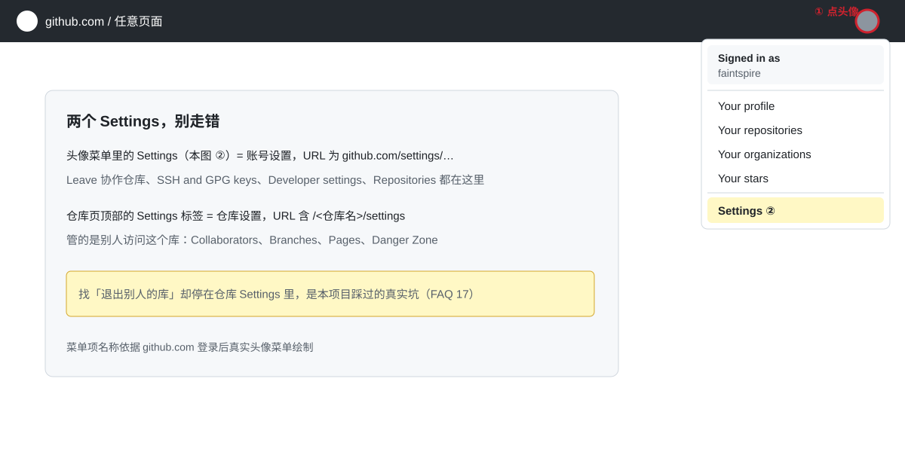

1. **①** 点击页面**右上角圆形头像**；
2. **②** 下拉菜单中选择 **Settings**；
3. 左侧导航栏点击 **Appearance**（项目多时向下滚动）。

> ⚠️ 未登录访问该链接会重定向到登录页，属正常行为。

### 4.2 选择主题

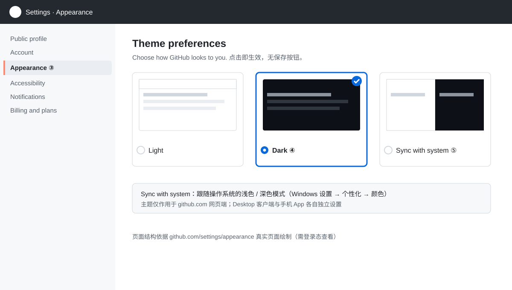

4. **③** 确认左侧 **Appearance** 处于选中状态；
5. **④** 在 Theme 区块**点击目标主题卡片**（Light / Dark / Sync with system），选中后出现蓝色边框 + 对勾；
6. **点击即生效，无需保存按钮**；刷新首页或任意仓库页确认配色已切换。

### 4.3 「Sync with system」的系统联动

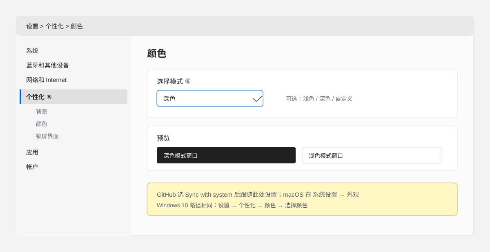

- **Windows**：**⑤** 设置 → 个性化 → 颜色；**⑥** 「选择模式」选 浅色 / 深色，GitHub 随即跟随；
- **macOS**：系统设置 → 外观 → 浅色 / 深色 / 自动（「自动」按时间切换，GitHub 同步跟随）。

---

## 五、将 doc/ 迁移为独立 GitHub 文档库

**目标**：把本仓库 `doc/` 目录（含 `images/`）放入一个**独立 GitHub 存储库**（建议命名 `sangerbox-docs`），作为在线文档使用，替代语雀。

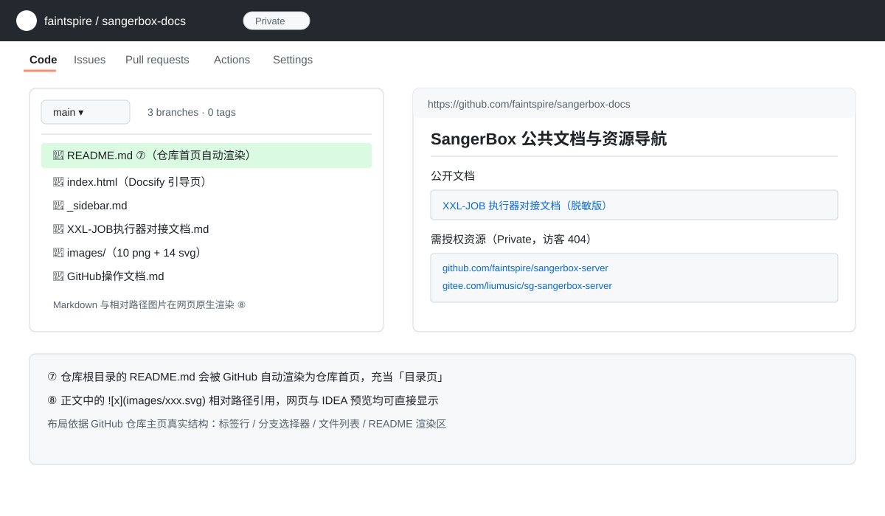

> GitHub / Gitee 均原生渲染 Markdown 与**相对路径图片**，`images/xxx.png` 这种引用在网页上直接可见，无需任何额外配置。

### 5.1 方案 A：新建文档库 + 复制推送（推荐）

**第 1 步**：按[第一章](#一创建-github-仓库建库)网页建库 `sangerbox-docs`，选 **Private**，**三个初始化选项都不勾**（保证空库，push 最顺）。

**第 2 步**：本地准备目录并复制文档（PowerShell）：

```powershell
New-Item -ItemType Directory -Force C:\Develop\project\sangerbox-docs
Copy-Item -Recurse C:\Develop\project\sg-sangerbox-server\doc\* C:\Develop\project\sangerbox-docs\
```

**第 3 步**：初始化并推送：

```powershell
cd C:\Develop\project\sangerbox-docs
git init
git add .
git commit -m "docs: 初始化在线文档库"
git branch -M main
git remote add origin https://github.com/<用户名>/sangerbox-docs.git
git push -u origin main
```

**第 4 步**：打开仓库网页验证 —— **⑦** 根目录 `README.md` 会自动渲染为仓库首页；**⑧** 点进任意 `.md` 确认正文与 `images/` 图片正常显示。

### 5.2 日常同步：主仓库 doc/ → 文档库

约定**主仓库 `doc/` 为唯一编辑源**，文档库只做发布副本，避免双份维护冲突。保存为 `sync-docs.ps1`，改完文档跑一次即可：

```powershell
param([string]$Msg = "docs: 同步文档 $(Get-Date -Format 'yyyyMMdd-HHmm')")
$src = "C:\Develop\project\sg-sangerbox-server\doc"
$dst = "C:\Develop\project\sangerbox-docs"
Copy-Item -Path "$src\*" -Destination $dst -Recurse -Force
Set-Location $dst
git add .
git commit -m $Msg
git push
```

### 5.3 方案 B：网页拖拽上传（偶尔改一两次时用）

仓库页 → **Add file → Upload files** → 把 `doc/` 下文件与 `images/` 文件夹整体拖入 → 填写 commit 信息 → Commit。适合不想在本机多维护一个仓库的场景。

### 5.4 方案 C：git subtree 拆分（需要保留 doc/ 的 git 历史时用）

在**主仓库**根目录执行：

```bash
git subtree split --prefix=doc -b docs-split
git push https://github.com/<用户名>/sangerbox-docs.git docs-split:main
```

后续 doc/ 有新提交时，重复上述两条命令即可增量同步。历史不重要就用方案 A，简单得多。

### 5.5 在线阅览增强（可选）

- 文档库根目录放一份 `README.md` 作为**索引首页**（列出所有文档链接），进入仓库即见目录；
- 需要侧边栏、全文搜索等知识库体验时，再上 **GitHub Pages + MkDocs**；注意 **Private 仓库的 Pages 需 GitHub 付费计划**，内部文档直接看仓库渲染即可，不必强上 Pages。

---

## 六、GitHub Pages 静态资源网站

参考站 `https://eternity4719.github.io/HowToLiveBetter/` 就是 GitHub Pages 的**项目站点**：一个普通公开仓库 + 开启 Pages + 若干静态文件（html/css/js/图片），**免费、无需服务器、无需备案**，push 后自动重新部署。

### 6.1 两种站点类型

| 类型 | 地址格式 | 仓库名要求 | 用途 |
|---|---|---|---|
| 用户站点 | `https://<用户名>.github.io/` | 必须等于用户名（`<用户名>.github.io`） | 个人主页，每人仅一个 |
| 项目站点 | `https://<用户名>.github.io/<仓库名>/` | 任意 | 文档站、工具站、演示页（参考站即此类） |

### 6.2 搭建步骤（纯静态，零构建）

1. 新建**公开**仓库（如 `HowToLiveBetter`）。⚠️ Pages 免费档**只支持 Public 仓库**，Private 需 GitHub 付费计划；
2. 在仓库根目录放入静态文件，最小可用只需一个 `index.html`：

```html
<!DOCTYPE html>
<html lang="zh-CN">
<head>
  <meta charset="UTF-8">
  <title>我的静态站</title>
</head>
<body>
  <h1>Hello, GitHub Pages</h1>
  
</body>
</html>
```

3. 提交并推送（见第三章）；
4. 仓库 **Settings → Pages**（图 7 **⑨**）；
5. **Source** 选 `Deploy from a branch`；**⑩** Branch 选 `main`、目录选 `/ (root)`（若静态文件放在 `docs/` 子目录则选 `/docs`）→ 点 **Save**；
6. **⑪** 页面顶部绿色横幅给出站点地址 `https://<用户名>.github.io/<仓库名>/`，等待 1~2 分钟部署完成后浏览器打开；
7. 后续更新：改文件 → `git push` → 站点自动重新部署（仓库 **Actions** 页可查看每次部署状态）。

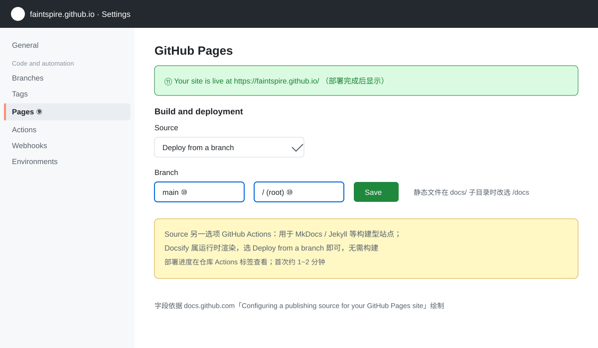

### 6.3 把 doc/ 的 Markdown 变成这种站点（与第五章衔接）

> 📌 **团队决策（2026-09-28）**：SangerBox 文档库定为 **Private**、**不开 Pages**；对外仅保留一个公开「链接指引页」（见 [6.5](#65-私有文档库--公开链接指引页模式团队现行方案)）。本节 Docsify / MkDocs 方案仅适用于**将来需要对外公开**的文档。

⚠️ 关键认知：**Pages 只托管静态文件，不会把 `.md` 自动渲染成网页**。要让现有 Markdown 文档变成参考站那样的网站，二选一：

**方式一（推荐，零构建）：Docsify 运行时渲染** —— 在文档库根目录加一个 `index.html` 加载 docsify，`.md` 原样保留：

```html
<!DOCTYPE html>
<html>
<head>
  <meta charset="UTF-8">
  <title>SangerBox 在线文档</title>
  <meta name="viewport" content="width=device-width,initial-scale=1.0">
  <link rel="stylesheet" href="https://cdn.jsdelivr.net/npm/docsify@4/lib/themes/vue.css">
</head>
<body>
  <div id="app">加载中…</div>
  <script>
    window.$docsify = { name: 'SangerBox 在线文档', loadSidebar: true, subMaxLevel: 3 }
  </script>
  <script src="https://cdn.jsdelivr.net/npm/docsify@4"></script>
</body>
</html>
```

再加一个 `_sidebar.md` 做侧边目录：

```markdown
- [GitHub 操作文档](GitHub操作文档.md)
- [部署配置文档](部署配置文档.md)
- [SangerBox 接口文档](SangerBox接口文档.md)
```

推送后开 Pages（Source 选根目录），即得到带侧边栏的文档站；文档里的 `images/xxx.png` 相对路径图片**原样可用**。

**方式二（构建型）：MkDocs** —— 本地 `mkdocs build` 生成 `site/` 静态目录再推送，样式更正式但每次改文档都要重新构建，维护成本高，暂不推荐。

> 中文文件名在 Docsify 下可用，但 URL 会被百分号编码；介意的话把文档文件名改成英文。

### 6.4 常见坑

| 现象 | 原因与处理 |
|---|---|
| 站点 404 | 分支/目录选错（文件在 docs/ 却选了 root）；开启不足 2 分钟；仓库名大小写与 URL 不一致 |
| Docsify 侧栏不显示，`_sidebar.md` 直连 404 | Pages 分支源部署默认跑 Jekyll，**Jekyll 忽略下划线开头文件**；仓库根目录加空文件 `.nojekyll` 后重新部署即恢复（本项目 2026-09-29 实踩）；另注意 Pages 构建队列可能延迟数分钟，用 deployments API 查状态 |
| 首页正常但 css/js/图片 404 | 项目站点带仓库名前缀，资源必须用**相对路径** `./style.css`，写成 `/style.css` 会指向站点根而 404 |
| 更新后内容没变 | 浏览器/CDN 缓存，Ctrl+F5 强刷；或 Actions 里部署尚未完成 |
| Private 仓库开不了 Pages | 免费档限制，改 Public 或付费；内部文档建议直接用仓库渲染（第五章） |
| 想绑自己的域名 | 仓库根加 `CNAME` 文件 + 域名商配 CNAME 解析，可选步骤 |

### 6.5 私有文档库 + 公开链接指引页模式（已作废，仅存档）

> 📌 **2026-09-29 变更**：私有文档库与单页指引页方案**作废**，改为 [6.6 个人公共知识库模式](#66-个人公共知识库嵌套独立仓库2026-09-29-定案)；公司私有内容统一留在本仓库 `doc/`，不再另建私有文档库。下表仅存档。

**决策**：文档库（`sangerbox-docs`）保持 **Private**、**不开 Pages**；另建一个**公开**小仓库只放一个链接指引页，作为对外唯一入口。

| 仓库 | 可见性 | Pages | 内容 |
|---|---|---|---|
| `faintspire/sangerbox-server` | Private | 不开 | 服务端代码；`origin` 已指向该库，原 Gitee 地址保留为 `gitee` 远程 |
| `faintspire/sangerbox-docs`（待建） | Private | 不开 | 全部真实文档与 images/，团队成员登录后查看 |
| `faintspire.github.io`（待建） | Public | 开 | Docsify 公共文档站：首页资源导航 + 可公开文档（首份：XXL-JOB 对接文档），源文件在 `doc/public-site/` |

公共站内容已生成于 `doc/public-site/`（推送公开库 + 开 Pages 即上线）：

| 文件 | 作用 |
|---|---|
| `index.html` | Docsify 引导页（加载侧边栏与主题） |
| `README.md` | 站点首页：公开文档列表 + 公开资源 + 需授权资源导航 |
| `_sidebar.md` | 侧边目录 |
| `XXL-JOB执行器对接文档.md` | 首份可公开文档（**accessToken 已脱敏为占位符**） |

- **公开资源（任何人可见）**：反馈邮箱 `feedback@sangerbox.com`、站点地址 `https://faintspire.github.io/`、已脱敏的对接类文档；
- **需授权资源（私有，无权限访客 404）**：`github.com/faintspire/sangerbox-server`、`gitee.com/liumusic/sg-sangerbox-server`、`github.com/faintspire/sangerbox-docs`（待建）。

> ⚠️ **公共发布脱敏纪律**：任何文件进入 `public-site/` 前必须移除 token / 密码 / 内网 IP / 账号等敏感值，替换为占位符并指向「向运维索取」；已在聊天、截图或历史提交中出现过的秘密值视为泄露，需轮换后再发布。

要点：

- 指引页**不要**出现内部文档正文、截图、接口地址、账号信息；
- 私有库链接对无权限访客显示 404（GitHub 不泄露私有库存在性），可放心放；
- 团队成员日常阅读走：登录 GitHub → 私有库网页渲染，或 IDEA 内直接看本地 `doc/`；
- 与第五章同步脚本不冲突：脚本只推私有文档库，指引页手工维护即可（改动极少）。

### 6.6 个人公共知识库（嵌套独立仓库，2026-09-29 定案）

**决策变更**：不再单独建私有文档库与单页指引页；公司私有内容统一留在本仓库 `doc/`（含图片），个人可公开知识拆到独立**公开**知识库 `faintspire-kb`。

| 仓库 | 可见性 | 内容 | 图片 |
|---|---|---|---|
| `faintspire/sangerbox-server`（本仓库） | Private | 代码 + `doc/` 公司文档 | 有（`doc/images/`） |
| `faintspire/faintspire-kb` | Public | 个人公共知识库（通用笔记） | **无**（纯文本，图示用编号步骤/表格） |

**隔离机制（两库提交互不影响）**：

1. `doc/faintspire-kb/` 目录嵌套在公司仓库工作区内，但**自身是独立 Git 仓库**（自有 `.git`、独立 main 分支）；
2. 公司仓库 `.gitignore` 增加 `/doc/faintspire-kb/`，父库 `git add .` / `git status` 完全看不见它；
3. ⚠️ 切勿对父库执行 `git add doc/faintspire-kb`：嵌套仓库会被登记为 **gitlink(160000)**，整个目录变成“子模块指针”，内部文件全部脱离父库跟踪（本项目 sg-dedup-server 曾踩此坑）；
4. 在 kb 目录内的 commit/push 只作用于 kb 库；父库提交 likewise 不碰 kb。

**上线步骤**：

1. GitHub 建**公开**空库 `faintspire-kb`（三个初始化项都不勾）；
2. `cd doc/faintspire-kb` → `git add .` → `git commit -m "docs: 初始化个人知识库"` → `git remote add origin git@github.com:faintspire/faintspire-kb.git` → `git push -u origin main`；
3. 可选：Settings → Pages 开项目站点 `https://faintspire.github.io/faintspire-kb/` 作为在线阅读入口（纯 Markdown 需 Docsify 引导页，参考 6.3）。

---

## 七、删除存储库

> ⚠️ **删除不可逆**：仓库代码、Issue、Wiki、Pages 站点一并消失；**90 天内**本人/组织 Owner 可在 Settings → Repositories 底部的 *Deleted repositories* 恢复，超期彻底消失。动手前先看完 7.2。

### 7.1 删除自己的仓库（图 8）

1. 进入目标仓库 → **Settings**；
2. 滚动到页面最底部 **Danger Zone** 区域；
3. **⑫** 点击 `Delete this repository` 红色按钮；
4. **⑬** 在弹窗中**完整输入仓库名**（如 `liumusic/old-demo`）完成确认，点击红色确认按钮；
5. 删除完成：原 URL 立即 404，协作者同步失去访问。

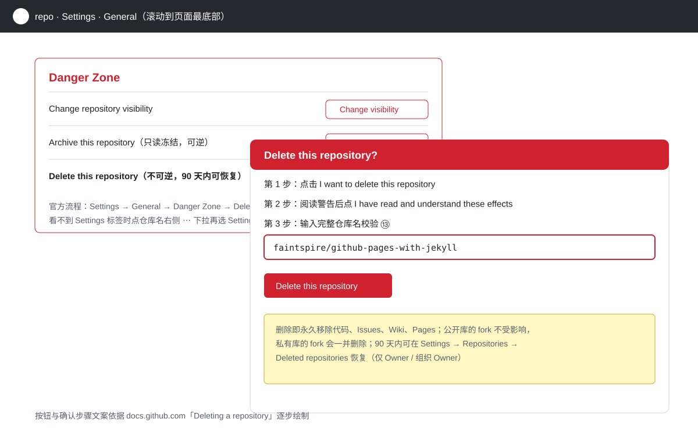

### 7.2 删除前检查清单

- [ ] 仓库内是否有**别处没有**的内容？先备份：`git clone --mirror <url>` 或网页 Download ZIP；
- [ ] 是否是别人 fork 的源头？删除后对方的 fork 仍保留，但会脱离上游、无法再同步；
- [ ] 是否绑定了 Pages 自定义域名、Actions Secrets、Webhook？删除即失效；
- [ ] 组织仓库：需要 **Owner 权限**才能删，成员无删除按钮属正常；
- [ ] 本地是否还有对应工作目录与未推送提交？删远程不会删本地，但本地 push 会失败。

### 7.3 拿不准就先 Archive 而不是 Delete

Settings → Danger Zone → **Archive this repository**：仓库变**只读**、从活跃列表消失、随时可 Unarchive 恢复。适合「暂时没用但以后可能要看」的仓库；确认彻底无用再 Delete。

### 7.4 批量清理建议

1. 打开自己主页 → Repositories 标签，按 **Recently updated** 排序过一遍，列出候选；
2. 一年以上无提交且无引用的 → 先 Archive 观察一个月；
3. 观察期无影响 → Delete；
4. 删完清理本地对应目录、IDE 项目列表、以及同步脚本里的路径引用。

### 7.5 删除 ≠ 退出：三种操作的影响面对比

| 操作 | 仓库本身 | 其他协作者/成员 | 别人的 fork | 别人本地 clone | 可逆性 |
|---|---|---|---|---|---|
| **Delete**（删除） | 全网消失（代码/Issues/PR/Wiki/Pages/Releases） | 立即失去访问，**不是仅你退出** | fork 副本保留但脱离上游 | 仍在，push/pull 404 | 90 天内仅 Owner 可恢复 |
| **Leave**（退出） | 不受影响 | 仅移除你自己 | 不涉及 | 你的 clone 变 403 | 需对方重新邀请 |
| **Archive**（归档） | 变只读，仍可见 | 仍可浏览，所有人（含 Owner）不可 push | 不涉及 | 可 pull 不可 push | 随时 Unarchive |

补充两点：

- 删除后其他人对该库的**提交记录与贡献统计（contribution graph）会一并消失**，这是删除唯一波及他人的地方；
- 自己拥有的仓库没有 Leave 可选（见 [8.4](#84-找不到-leave-按钮先分清三种情况)），只能在 Delete / Archive 之间选。

---

## 八、退出别人的项目存储库

「退出」分四种情形，入口完全不同，先对号入座：

| 情形 | 判断依据 | 入口与操作 |
|---|---|---|
| **协作者（Collaborator）** | 别人仓库出现在你主页 Repositories 列表，且你有 push 权限 | 头像 → **Settings → Repositories** → 找到该仓库 → **⑭ Leave** → 弹窗 **⑮** 确认 |
| **组织成员** | 头像菜单有 *Your organizations*，且你在该组织 People 列表 | 头像 → **Your organizations** → 进入组织 → **Leave organization** |
| **自己 fork 的仓库** | 仓库页顶部显示 *forked from xxx/yyy* | fork 属于**你自己的仓库**，「退出」= 按第七章删除它 |
| **只是关注/收藏** | 仅想停止通知或去掉星标 | 仓库页右上角 **Unwatch** / **Unstar**，不涉及权限 |

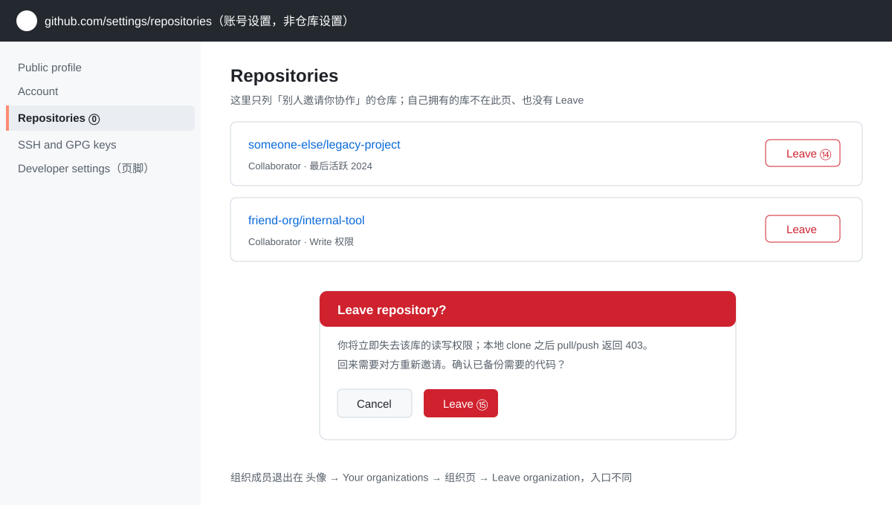

### 8.1 退出前必做

- **备份需要的代码**：退出私有库后本地 clone 还在，但 `git pull / push` 会 403；把需要的分支提前 clone 到独立目录或推到自己仓库；
- **确认无未推送提交**：本地有未 push 的工作先交给对方（patch / PR / 压缩包），退出后无法再推；
- **组织退出额外注意**：组织内**所有**私有库立即不可访问，含你参与的项目；先交接。

### 8.2 退出后验证

- 自己主页 Repositories 列表不再出现该仓库；
- 直接访问原仓库 URL：私有库显示 404，公开库仍可浏览但无 push 权限；
- 对方仓库 Settings → Collaborators 列表中已无你的账号。

### 8.3 只是嫌吵？别用 Leave

通知太多用 **Unwatch**（仓库页右上角 Watch 按钮 → Participating and @mentions 或 Ignore）；Leave 会真实移除权限，事后要回来得对方重新邀请。

### 8.4 找不到 Leave 按钮？先分清三种情况

| 你看到的现象 | 真实原因 | 正确操作 |
|---|---|---|
| 在仓库主页上找 Leave | **Leave 从不在仓库主页**（主页只有 Unpin/Unwatch/Fork/Star），它在账号设置里 | 头像 → Settings → 左侧 **Repositories** 列表页找对应行 |
| 面包屑第一段是自己的用户名（如 `faintspire/xxx`） | 这是**你自己拥有的仓库**（含 Learning Lab 课程自动生成的练习库），不存在“退出” | 不要了就按第七章 **Delete**，或先 **Archive** |
| 仓库属于某组织且你在成员列表 | 组织级关系，单库 Leave 不适用 | 组织页 → **Leave organization** |

> 提示：仓库页右上角的 **Unwatch / Unstar** 只影响通知与星标，与权限无关；能看见仓库页 **Settings** 标签说明你对该库有 admin 权限（Owner 或被授予 admin 的协作者）。
>
> ⚠️ **两个 Settings 别混淆**：**仓库页顶部的 Settings 标签**（URL 含 `/<仓库名>/settings`，如 Settings → Collaborators）管的是“别人访问这个库”，里面只有 Add people / 移除协作者，**没有你自己的 Leave**；**头像菜单里的 Settings**（URL 为 `github.com/settings/...`）才是账号设置，Leave 在其中的 **Repositories** 页，直达地址 `https://github.com/settings/repositories`。

---

## 九、常见问题 FAQ

| # | 问题 / 现象 | 说明与处理 |
|---|---|---|
| 1 | `git push` 报 rejected / fetch first | 远程有新提交，先 `git pull --rebase` 再 push，见 [3.1](#31-推送被拒non-fast-forward) |
| 2 | HTTPS 认证失败 403 / 反复要密码 | 凭据管理器中删除旧凭据重登，或改 SSH 方式，见 [2.2](#22-ssh-方式免每次输入账号密码推荐长期使用) / [3.2](#32-凭证问题) |
| 3 | 网页上 Markdown 图片不显示 | 多为：`images/` 目录没提交、路径写成绝对路径、文件名大小写不一致；统一用相对路径 `images/xxx.png` |
| 4 | 中文文件名在 git 状态里显示为转义码 | 执行 `git config --global core.quotepath false` |
| 5 | 文档库选 Public 还是 Private | 公司内部一律 Private；Private 仓库网页渲染不受影响 |
| 6 | 主仓库 doc/ 与文档库要留两份吗 | 建议：主仓库为编辑源、文档库为发布副本，用 [5.2 同步脚本](#52-日常同步主仓库-doc---文档库) 单向同步 |
| 7 | 改了主题但 Desktop / 手机 App 没变 | 正常，Appearance 仅作用于网页端 |
| 8 | 设置了 Dark 页面仍浅色 | 检查 Dark Reader 等强制配色插件，先禁用再验证 |
| 9 | Pages 站点打开 404 | 分支/目录选错、部署未满 2 分钟、仓库名大小写；到 Settings → Pages 与 Actions 看部署状态，见 [6.4](#64-常见坑) |
| 10 | Pages 首页正常但样式/图片丢失 | 项目站点带仓库名前缀，资源必须用相对路径 `./xxx`，不能写 `/xxx` |
| 11 | 误删仓库能恢复吗 | 90 天内：Settings → Repositories 底部 Deleted repositories 可 restore；超期不可恢复 |
| 12 | Markdown 推到 Pages 上不渲染 | Pages 只托管静态文件；用 Docsify / MkDocs 转换，见 [6.3](#63-把-doc-的-markdown-变成这种站点与第五章衔接) |
| 13 | Token 粘贴后 IDEA 报 401 / 无法登录 | scopes 勾选不全或 token 已过期；重新生成并勾全 [3.4](#34-intellij-idea-内置-github-集成的-token-配置) 列出的 6 项 |
| 14 | Token 不小心提交 / 截图泄露了怎么办 | 立即到 Settings → Developer settings → Tokens 页 **Delete** 撤销再重新生成；IDEA 里移除账号重绑 |
| 15 | 仓库页找不到 Leave 按钮 | Leave 不在仓库主页；自己的库（含 Learning Lab 练习库）只能 Delete/Archive；协作者库到账号 Settings → Repositories 里 Leave，见 [8.4](#84-找不到-leave-按钮先分清三种情况) |
| 16 | 删除仓库后别人那边还有吗 | 仓库对所有人消失；仅他人 fork 副本与本地 clone 残留；90 天恢复权仅 Owner，见 [7.5](#75-删除--退出三种操作的影响面对比) |
| 17 | 在仓库 Settings → Collaborators 里找退出 | 该页管理他人对你库的访问，无自己退出入口；Leave 在账号设置 `github.com/settings/repositories`，见 [8.4](#84-找不到-leave-按钮先分清三种情况) |
| 18 | 账号设置→存储库页列出的都是自己的库吗 | 该页按 Owner 分组列出你拥有/可管理的库；**行内出现 Leave 按钮的才是别人邀请你协作的库**，没有按钮即为自己所有；🔒 图标=Private，无锁=Public；「已删除存储库」标签页可在 90 天内恢复误删库 |
| 19 | 公共文档里能放配置示例吗 | 可以，但 token / 密码 / 内网 IP 必须脱敏为占位符；见 6.5 脱敏纪律与 `public-site/README.md` 发布纪律 |
| 20 | push 被拒 GH001: Large files detected | 历史提交中含 >100 MB 文件（常见为误提交的日志/安装包）；GitHub 整包校验，一个超标全拒，只删文件再提交无效。处理：先 `git clone --mirror` 备份 → 补 `.gitignore` → `git filter-repo --invert-paths --path-glob '*/logs/*'` 清历史 → 重加 remote 重推；旧远程（如 Gitee）需 force push；备选 `git lfs migrate import`，见 3.3 |
| 21 | push 报 Recv failure: Connection was reset / Could not connect to port 443 | 连接层失败（未进入打包阶段），多为到 github.com:443 的跨境链路间歇性重置，与仓库/凭据无关；已推成功的分支不受影响。处理：`Test-NetConnection github.com -Port 443` 测连通 → 通则直接重推；不通则改走 SSH over 443（`ssh://git@ssh.github.com:443/<owner>/<repo>.git`）或仅对 GitHub 配代理 `git config --global http.https://github.com.proxy http://127.0.0.1:<port>`，见 3.2 |

---

## 十、验证清单

**建库 / 拉取 / 推送**

- [ ] 已在 GitHub 创建目标仓库并确认可见性符合预期
- [ ] `git clone` 或 `git remote add` 成功，`git remote -v` 地址正确
- [ ] 一次完整的 `add → commit → push` 成功，网页可见提交记录

**文档库迁移**

- [ ] 已创建 `sangerbox-docs` 仓库（Private、空库初始化）
- [ ] 本地目录已包含 `doc/` 全部内容（含 `images/` 子目录）
- [ ] `git push -u origin main` 成功
- [ ] 网页打开任一 `.md`，正文与图片均正常渲染
- [ ] 同步脚本 `sync-docs.ps1` 实跑一次成功

**外观设置**

- [ ] 已在 Theme 区块选中目标主题
- [ ] 刷新首页确认配色变化
- [ ] （仅 Sync with system）切换一次系统深浅色，确认 GitHub 跟随

**Pages 静态站点**

- [ ] 仓库 Settings → Pages 已选择分支与目录并 Save
- [ ] 浏览器打开 `https://<用户名>.github.io/<仓库名>/` 可见页面
- [ ] 修改一次 index.html 推送后，站点内容在 1~2 分钟内更新

**删除 / 退出仓库**

- [ ] 删除前已确认仓库无未备份的独有内容（或已 clone --mirror 备份）
- [ ] 删除后原 URL 访问 404
- [ ] 退出他人仓库后，自己主页 Repositories 列表不再显示该仓库

**IDEA 集成与 Token**

- [ ] 已用 classic token 勾全 6 项 scopes 并设置过期时间
- [ ] IDEA Add Account 成功，Clone 窗口能列出自己的 GitHub 仓库
- [ ] token 未出现在任何仓库文件、聊天记录或截图中

**链接指引页**

- [ ] 公开站仓库仅含 `public-site/` 脱敏内容（index.html / README / _sidebar / 公共文档），无内部正文与敏感值
- [ ] Pages 打开指引页正常；内部库链接对无权限访客显示 404
- [ ] 私有文档库确认未开启 Pages
- [ ] `public-site/` 内所有文件已脱敏（无 token / 密码 / 内网 IP / 账号）

---

## 附：示意图索引

| 图 | 文件 | 对应章节 / 步骤 |
|---|---|---|
| 图 0 | `images/github-guide-0-login.svg` | 1.0 ①② 账密 → ③ Sign in → ④ passkey |
| 图 1 | `images/github-appearance-1-enter-settings.svg` | 4.1 ① 点头像 → ② 选 Settings |
| 图 2 | `images/github-appearance-2-theme-cards.svg` | 4.2 ③ 选中 Appearance → ④ 点主题卡片 |
| 图 3 | `images/github-appearance-3-windows-sync.svg` | 4.3 ⑤ 个性化→颜色 → ⑥ 选择模式 |
| 图 4 | `images/github-guide-4-create-repository.svg` | 1.1 ① 仓库名 → ② 可见性 → ③ 创建 |
| 图 5 | `images/github-guide-5-git-clone-pull-push.svg` | 二 / 三章 ④ clone → ⑤ commit → ⑥ push |
| 图 6 | `images/github-guide-6-docs-repo-online.svg` | 5.1 ⑦ README 首页 → ⑧ 在线渲染 |
| 图 7 | `images/github-guide-7-pages-settings.svg` | 6.2 ⑨ Pages 菜单 → ⑩ 分支/目录 → ⑪ 站点地址 |
| 图 8 | `images/github-guide-8-delete-repository.svg` | 7.1 ⑫ Delete 按钮 → ⑬ 输仓库名确认 |
| 图 9 | `images/github-guide-9-leave-repository.svg` | 8 章 ⑭ Leave → ⑮ 确认弹窗 |
| 图 10 | `images/github-guide-10-token-scopes.svg` | 3.4 ⑯ Developer settings → ⑰ 过期时间 → ⑱ scopes → ⑲ 生成 → ⑳ 复制 |

> 示意图用于说明操作位置；真实界面以 GitHub 当前版本为准。若页面出现本文未列出的选项，不影响上述主流程。
> 2026-09-29 起：本文配图全部替换为**无水印 SVG**（依据 github.com 与 docs.github.com 真实页面绘制），旧 PNG 已删除；规范见《SSH密钥使用文档》附图规范。
